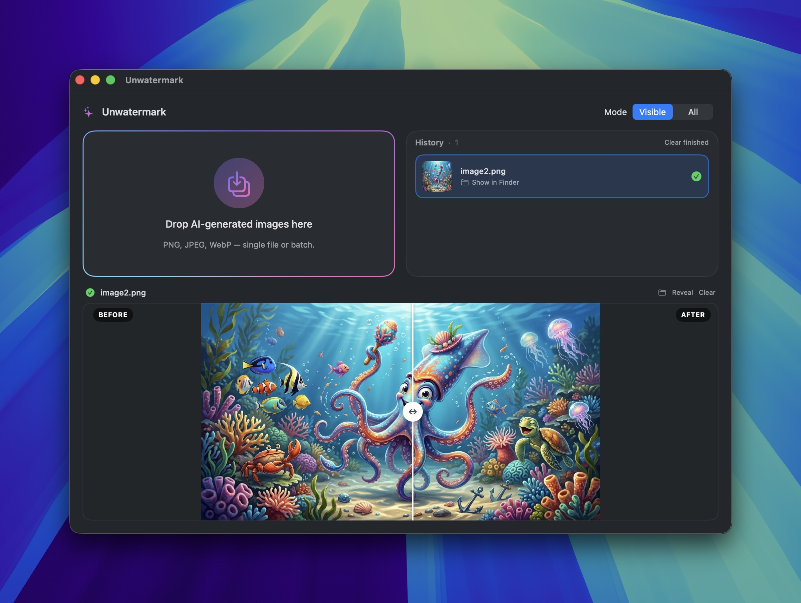

# Unwatermark

A native macOS app for removing AI watermarks from images — drag, drop, done.

Unwatermark is a thin, friendly **SwiftUI shell** around the open-source [`remove-ai-watermarks`](https://github.com/wiltodelta/remove-ai-watermarks) Python CLI. It does not reimplement watermark removal — it bundles a one-click installer, a polished drag-and-drop UI, and a job queue around the upstream tool so you never have to open a terminal.



---

## What it does

Drop one image or a hundred onto the window. Unwatermark hands each file to `remove-ai-watermarks` and writes the cleaned copy alongside the original as `<name>-unwatermarked.<ext>`. The originals are never modified.

### The interface

- **Drop zone (top-left).** Drop any number of PNG / JPEG / WebP / HEIC / TIFF files (or whole folders) here. Animated gradient ring, with a scale bump on hover.
- **History (top-right).** Every image you've dropped this session lives here, newest first, with a thumbnail and live status (`Queued → Cleaning… → Done / Failed`). Clicking a row makes it the current preview. The header shows a count and a small spinner whenever anything is still in flight; a `Clear finished` button appears once there are completed rows.
- **Preview (full-width, below).** Shows the currently selected job. While it's processing you get a placeholder with a progress bar; on completion it becomes a **draggable before/after compare slider** — drag anywhere over the image to wipe between the watermarked original (left) and the cleaned result (right). Newly added images auto-become the preview; pick any row in history to compare older results.
- **Mode picker (header).** Segmented `Visible` / `All` switch that affects every subsequent job. Picking `All` for the first time pops a one-time confirmation explaining the ~2 GB model download.

### Processing modes

| Mode | What it removes | Speed | Notes |
|------|-----------------|-------|-------|
| **Visible** | The Gemini / Nano Banana sparkle overlay + AI metadata (EXIF, C2PA, XMP) | Fast, CPU-only | The default. Works offline, deterministic. |
| **All** | Visible sparkle + **invisible** watermarks (SynthID, StableSignature, TreeRing, DWT) + metadata | Slow, GPU-accelerated on Apple Silicon (`--device mps`) | Uses diffusion-based regeneration. First run downloads a ~2 GB SDXL model. Shows a one-time warning. |

### Other niceties

- **Auto-discovers** the CLI in `~/.local/bin`, `~/.local/share/uv/tools/…/bin`, `/opt/homebrew/bin`, and standard system paths.
- **Installs the CLI for you** on first launch via a guided wizard (`uv` recommended, `pipx` as alternative) with live install logs.
- **Queues jobs serially** with per-image status and a `Reveal in Finder` shortcut.
- **Handles missing files gracefully.** If you delete or move the original or the cleaned image after processing, picking that history row shows a friendly "preview no longer available" card instead of crashing or silently rendering blank.
- **Remembers** the CLI path, your last-used mode, and your acknowledgement of the diffusion-mode warning across launches.

---

## Under the hood

Unwatermark is just the cockpit. The engine is:

### [`wiltodelta/remove-ai-watermarks`](https://github.com/wiltodelta/remove-ai-watermarks)

An MIT-licensed Python CLI that:

- Reverses the alpha-blended Gemini / Nano Banana **sparkle logo** with a known alpha map.
- Regenerates images via SDXL diffusion to defeat **invisible** watermarks (SynthID v1/v2, StableSignature, TreeRing, DWT/steganographic).
- Strips C2PA Content Credentials, EXIF, PNG text chunks, XMP DigitalSourceType — the metadata that triggers "Made with AI" labels on Instagram, Facebook, and X.
- Protects faces from diffusion distortion via automatic face extraction and reblending.
- Includes NCC-based watermark detection with confidence scoring.

Supported source models include Google Gemini / Nano Banana / Gemini 3 Pro, OpenAI DALL-E 3 / ChatGPT, Stable Diffusion, Adobe Firefly, Midjourney, and anything carrying SynthID / StableSignature / TreeRing.

The shell talks to the CLI as a subprocess — there is no Python embedded in the app bundle. Updating the upstream tool (`uv tool upgrade remove-ai-watermarks`) immediately benefits the app with no rebuild.

---

## Requirements

- **macOS 14 (Sonoma)** or later
- **Apple Silicon recommended** — the diffusion mode uses Metal Performance Shaders (`mps`) and is dramatically faster on M-series chips. Intel Macs work but fall back to CPU for diffusion.
- **~3 GB free disk** if you plan to use **All** mode (for the SDXL model cache).
- An internet connection on first launch (for installing the CLI; subsequent runs are offline).

---

## Install

### Option A — Pre-built app

Download the latest `.dmg` or `.zip` from the [Releases](../../releases) page, drag `Unwatermark.app` into `/Applications`, and launch it. On first launch the setup wizard installs the CLI for you.

### Option B — Build from source

```bash
git clone https://github.com/<you>/Unwatermark.git
cd Unwatermark
open Unwatermark.xcodeproj
```

Then build & run with `⌘R` in Xcode, or from the command line:

```bash
xcodebuild -project Unwatermark.xcodeproj -scheme Unwatermark build
```

Swift 6.2 / Xcode 16 or newer is required.

---

## First run

1. The app **probes** for `remove-ai-watermarks` on `PATH` and in the usual install locations.
2. If it's missing, the **Setup** wizard appears. Pick `uv` (recommended) or `pipx`, hit Install, and watch the live log.
3. Once installed, the wizard hands off to the main window. Drop images, pick a mode, wait.

> The setup wizard runs unsandboxed subprocesses (`/bin/sh -c "curl … | sh"` for the `uv` bootstrap when needed, then `uv tool install remove-ai-watermarks`). For that reason the app ships with **App Sandbox and Hardened Runtime disabled**. If you need a sandboxed build you'll have to vendor the CLI inside the bundle.

---

## Architecture (for contributors)

```
UnwatermarkApp ──► RootView ──┬─► ProbingView      (looking for CLI)
                              ├─► SetupView        (install wizard: uv | pipx)
                              └─► MainView ──► DropZoneView + ProcessingListView
```

Pure SwiftUI on `@Observable` + `@MainActor`. No Combine, no SPM dependencies, no embedded Python. See [`CLAUDE.md`](CLAUDE.md) for a file-by-file walkthrough.

---

## FAQ

**Is this legal?** Removing watermarks from images you own or have the right to modify is generally fine. Removing watermarks to misrepresent AI-generated content as human-made, or to bypass platform policies, may violate the terms of service of the AI provider or downstream platform. Use responsibly.

**Why disable the sandbox?** The app launches arbitrary CLI tools and reads user-selected file paths anywhere on disk. Sandboxing would either break the install flow or require shipping a frozen Python runtime inside the bundle. The current trade-off favours simplicity and upstream-tracking.

**Does it phone home?** No. The app makes no network requests. The Python CLI downloads its SDXL model from Hugging Face the first time you use **All** mode, and that's it.

**Can I batch a folder?** Drag the folder onto the drop zone — it expands to the contained images.

---

## Credits

- **[`wiltodelta/remove-ai-watermarks`](https://github.com/wiltodelta/remove-ai-watermarks)** — the entire watermark-removal pipeline. This app would be empty without it.
- SDXL by Stability AI (used by upstream for diffusion-based regeneration).

---

## License

Unwatermark is released under the **MIT License**. See [LICENSE](LICENSE).

The bundled CLI [`remove-ai-watermarks`](https://github.com/wiltodelta/remove-ai-watermarks) is **also MIT-licensed**, © 2025 wiltodelta. It is not redistributed in this repo — the app installs it on first launch via `uv` / `pipx`.
